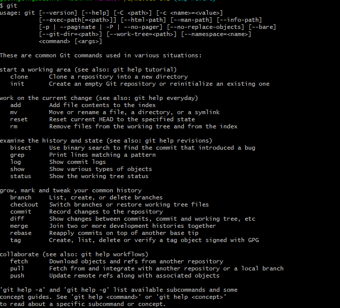
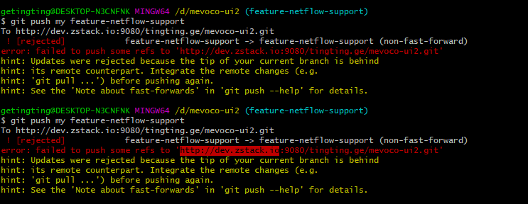
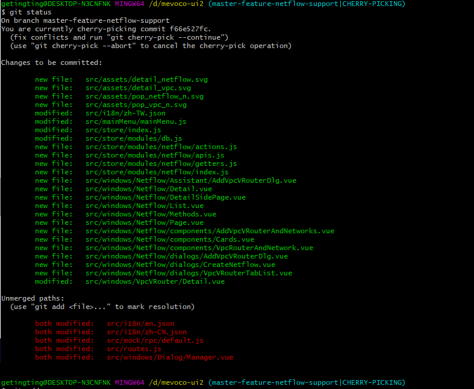
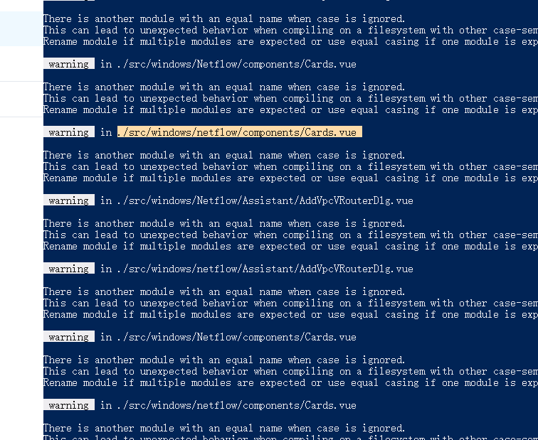

# git  合集

## 二、开发中遇到的问题总结

https://www.imooc.com/learn/208



### 1、使用git在本地创建一个项目的过程

```
进入项目目录

git init                                      //初始化，创建版本库

touch README                                 //创建README文件

git add README							     //将README文件添加到暂存区

git commit -m ‘first commit’                 //提交更新到仓库，并注释信息‘first commit’

git remote add origin git@github.com:dedsf/hello-world.git    //连接远程github项目

git push -u origin master                    //将本地项目更新到github项目上去
```

==注意：==有可能会遇到一下的问题：

在进行远程连接的时候如果遇到fatal: remote origin already exists.     可以先$ git remote rm origin   再进行远程连接


### 2、git rebase（关运行）

平常开发新feature的时候会在当天把代码commit到本地，到最后开发完成的时候会一起rebase一份，提交到远端分支，具体做法

1、（平常开发的时候）

	git   commit    -a  -m   'feature-xxxx-当天时间'         

2、（最后一天准备提交的时候）

	git   commit    -a  -m   'feature-xxxx-当天时间' 
	
	git   status     （查看此时分支是否干净）
	
	git   log		（查看日志，看它们的commit号）
	
	git   rebase   -i    commit号（第一次提交之前的那个commit号）
	
	除第一个pick以外，其他的改pick为s    
	
	保存退出   ：wq
	
	git   status  （查看是否rebase完成）
	
	记录此次的commit号

注意： 

如果你异常退出了，可以git rebase –edit-todo 重新进入，继续编辑；

如果遇到下图这样的问题，直接git  add .  即可解决


3、把远端分支拉下来，并在本地建立一个相同名字的分支

```html
git   checkout   master

git    fetch    origin    feature-xxxx: feature-xxxx  （把远端代码拉下来，并在本地创建一个名称相同的分支）

git     checkout    feature-xxxx    （切换到那个分支）

git 	cherry-pick     commit号（之前rebase的那个commit号）

git  	push   my   feature-xxxx	（push到远端）

gitlab上请求merge，选择需要的远端分支
```

### 3、当从feature branch 提到master上去时

（以feature-common-error为例）（这边好像理解错了，这边是直接在原来本地和远端同名的分支上提交的，但是这边这样的话，应该会有冲突吧，和master上的代码）（所以这边应该可以在master上新建一个本地的分支，然后直接pull远端feature分支的代码，rebase之后就可以提交了）

​	本地分支名：feature-common-error

​	远端分支名：feature-common-error

​	1、git   pull   origin    feature-common-error 	 (在本地的分支上把远端的featureBranch上的代码pull下来)

​	2、git   log																 (找最初的commit号)

​	3、git   rebase     -i      (commit 号)						(进行rebase)

​	4、git    log																(查看是否rebase成功)

​	5、git    status														   (查看此前状态)

​	6、git    push   my    feature-common-error		(推到master上去)


### 4、如果推到maser有冲突的话

根据（2）推到master 如果出现下面的问题，有可能是和master上面的代码有冲突



1、可以看一下，代码是否有冲突，如果有冲突，进行解冲突

2、结完冲突后，看下状态 git  status   



3、git  add

4、git  push   --continue

5、git   status


### 5、推到master上面的另一种方法

这边和在master的新分支上pull远端分支上的代码是一样的，我觉得这样会比较好，冲突可以在本地发现

1、git  status

2、git  log

3、git   rebase   -i   commit号

4、改pick为s   :wq 保存并退出

5、git  log

6、在maser上新开一个分支，把最新的commit 号，cherry-pick过去   （如果cherry-pick有冲突，就解冲突，解完冲突看状态，git add 后   git   cherry-pick   --continue）

7、再push

8、有冲突解冲突，没冲突就over

### 6、git reflog	

可以看到在当前分支所做的所有操作

### 7、git    xxx     --abort 

回到什么指令之前，例：git   merge    --abort


### 8、遇到pull  master上代码pull不下来的情况

有时候pull代码，会pull不下来，会遇到以下这种情况


再次pull无果后，可以这样：git pull  origin master:master

### 9、编译出错

##### 1、there is another module with anequal name when case is ignored

这种情况，可以看一下，import的路径的大小写是否写对




### 10、本地代码脏乱，一键搞定

git fetch --all && git reset --hard origin/master && git pull

### 11、删除本地分支

git    branch   -d   '分支名'             //注意：删除分支之前，先切换到其他分支


### 12、pr冲突

当提的pr冲突时，可以在本地更改后，重新-f进去

如果，在本地没有发现冲突，可能是本地的分支和远端的不同步，导致冲突，可以把本地的分支fetch一份远端的，同步远端的，此时可以rebase一下（有时候rebase  master 上的代码不成功，可以fetch 一份 origin上的）

```
git fetch origin feature-netflow-ha
git rebase origin/feature-netflow-ha
git diff
git checkout feature-netflow-ha-changeVrouterName
git rebase feature-netflow-ha     （此时就会发现冲突，解完冲突后）
git status
git add .
git rebase --continue
git staus
git push -f my feature-netflow-ha-changeVrouterName
git status

```

### 13、提交错误

如果输入git push origin  master ，提示错误：error:failed to push som refs to …….

解决方法：

​	

```
git pull origin master   //先把远端的github上面的文件拉下来

git push origin master
```


### 14、git回退版本并提交

直接找到需要回退的版本号(83ff2785)，reset之后，强推

查询所需要回退的版本号：如图


```
git reset –hard 83ff2785

git push -f origin matser
```


### 15、git防坑：git push 远端无分支不提示

如果你git push 感觉push上去了，在远端查一下，确保真正的push上去了，因为如果远端没有该分支的话，不会报错


### 16、在feature上rebase master上的代码

有时候会出现这样的问题，你的feature会和别人的feature之间有影响，所以要在你的feature-branch上和master上的代码合并一下，再次测试是否适配

这样的话，可以在本地和你feature-branch同名的分支上     git   rebase origin/master

然后push上去。


### 17、git checkout .

git checkout  -- <file>(文件url)

把工作区的修改全部清空，回到最近的一次add或者commit

git clean -df 

删除当前目录下没有被track过的文件和文件夹    删除一些没有被 git add 的文件


### 18、git reset HEAD <file>  （文件名）

(use "git reset HEAD <file>..." to unstage) 可以把暂存区的修改撤销掉

这边可以把提交到暂存区的代码clean掉  重新放回到工作区


### 19、git blame

查找指定文件被谁修改过

例：git blame -L 10, 50 src/windows/V2V/Page.vue

==注意：逗号左右没有空格==

### 20、没有权限改代码


有时候，提交代码的时候会遇到冲突，可是在本地看的时候，看不见冲突，有可能是没有权限改代码，权限被禁掉了，这时候可以把node关了，再次git status就会发现冲突，这时候解冲突就可以了。


### 21、权限问题-2


这边可以看到是因为公钥的原因，有可能是更新的电脑的公钥，把本地电脑的公钥，再次添加一下就可以了。


### 22、remote添加

 git remote add my http://*** 


### 23、git stash

用于想要保存当前的修改，但是想回到之前最后一次提交的干净的工作仓库时进行的操作，

最新的存储待在refs/stash

将本地的修改保存起来，并且将当前代码切换到HEAD提交上

git stash list 查看

git stash show 用于校验

git stash apply 用于重新存储

git stash pop 让保存的代码重新进入工作区（移除单个存储单元）

git stash === git stash save


### 24、push报错（the remote end hung up unexpectedly）

问题描述：Git在推送项目时报错：fatal: The remote end hung up unexpectedly。

问题原因：推送的文件太大。

解决方法：

1、修改git config 文件的postBuffer的大小

```
git config --local http.postBuffer 524288000
```

ps：--local 只对本地有效

2、直接修改本地仓库的.config文件

.git   => config 打开文件

postBuffer 修改

3、重新push一次     