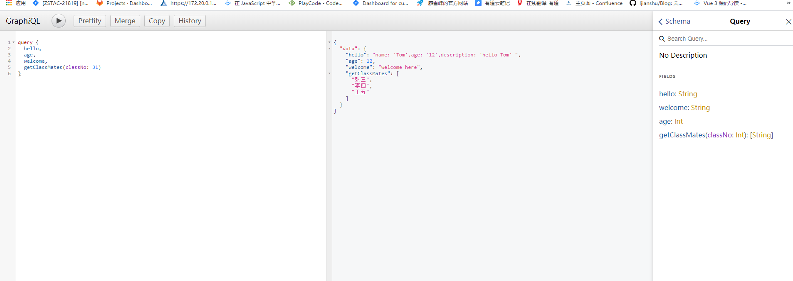
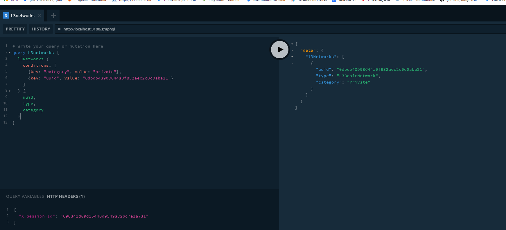

# graphgl

## 简介：

是一种用于API的查询语言。GrapgQL对API中的数据提供了一套易于理解的完整描述，使得客户端能够准确地获得它需要的数据，而且没有任何冗余，也让API更容易地随着时间推移而演进，还能用于构建强大地开发工具。

官网：

https://graphql.org
https://graphql.org.cn


 https://segmentfault.com/a/1190000014131950 

 https://jerryzou.com/posts/10-questions-about-graphql/ 

 https://graphql.cn/graphql-js/graphql-clients/     通俗易懂的教程


优势：

1、准确地获得自己想要的数据，不多不少

2、获取多个资源，只需要发一个请求

3、描述型的查询语言

4、描述所有可能的系统类型  //加上类型判断

  

## 与restFul的对比

属性状态转移 representational state trasfer

通用的系统架构，不受语言的限制

1、restful一个接口只能返回一个资源，graphql一个接口可以返沪多个资源（单一入口）

2、restful用不同的url来区分资源，grapgql用类型来区分资源


## 基本类型

大多数情况下，你所需要做的只是使用GraphQL schema language 指定你的API需要的类型，然后作为参数传给buildSchema函数

支持的标量类型有 String、Int、Float、Boolean、ID(表示唯一的标识符)

默认情况下，每个类型都是可以为空的----意味着所有标量类型都可以返回null。使用感叹号可以标记一个类型不可为空，如String！ 表示非空字符串

如果是列表类型，使用方括号将对应数字包起来，如[int]，表示一个整数列表


```js
var schema = buildSchema(`
type Query {
  hello: String,
  welcome: String,
  age: Int,
  tags(accountUuid: String, type: String): [Tag]
}`)    // 使用graphQL schema language 构建一个schema  这里定义查询的语句和类型

type Tag {
  name: String
  uuid: String
  color: String
}
```


```js
extend type Query {
  vms(conditions: [String], pageIndex: Int, pageSize: Int): [Vm]!
}   //这边可以添加参数   conditions: [String], pageIndex: Int, pageSize: Int

type Vm {
  name: String
  uuid: String
  createDate: String
  lastOpDate: String
  state: String,
  vmConsoleMode: String
  vmNics: [VmNic]
  owner(count: Int): Owner
  tags(accountUuid: String, type: String): [Tag],
  capabilities: Capabilities
  host(loginType: LoginType!, licType: LicType!): Host
  mdevDeviceSpecs(licType: LicType!): [MdevDeviceSpec]
  vmCdRoms: [VmCdRom]
  vmCdRomLimit: Int
  numa: Boolean
  cluster: Cluster
}
type VmNic {
  deviceId: Int
}

type Owner {
  name: String
}

type Tag {
  name: String
  uuid: String
  color: String
}

type Capabilities {
  LiveMigration: Boolean,
  MemorySnapshot: Boolean,
  Reimage: Boolean,
  VolumeMigration: Boolean
}

type MdevDeviceSpec {
  uuid: String
  name: String
  specification: String
  type: String
  state: String
  createDate: String
  lastOpDate: String
}

type VmCdRom {
  uuid: String
  name: String
  deviceId: Int
  vmInstanceUuid: String
  createDate: String
  lastOpDate: String
}

```


## 一、查询和变更

### 别名（Aliases）

就是起一个别名


### 片段（Fragment）

可复用性单元，可复用的字段的集合，这边可以理解为公有的字段提取出来，组成的obj，提高代码的复用性


### 操作类型和操作名称

操作类型包括：query mutation subscription 用来描述打算做什么类型的操作

操作名称：是指操作的有意义的明确的名称

```js
query HeroNameAndFriends {
  hero {
    name
    friends {
      name
    }
  }
}
```


### 变量（Variables）

就是参数是可变的，这样的话，就不用取别名了，取别名真的是很坑的操作

1. 使用 `$variableName` 替代查询中的静态值。
2. 声明 `$variableName` 为查询接受的变量之一。
3. 将 `variableName: value` 通过传输专用（通常是 JSON）的分离的变量字典中

这边呢，就像普通的传参一样，但是变量的前缀必须为$


### 指令（Directives）

这边呢，就是根据传来的参数，判断需要的字段

例如：主列表页面不需要type字段，但详情页需要type字段，这边呢，就可以给一个参数，表示是需要还是不需要该字段

```js
# { "graphiql": true, "variables": { "episode": "JEDI", "withType": false } }
query Hero($episode: Episode, $withFriends: Boolean!) {
  hero(episode: $episode) {
    name
    type @include(if: $withType) {
      name
    }
  }
}
// 这边的意思就是 if withType = true的情况下，会有 type字段，否则没有type字段
```

==@include==       就是如果xxx就包括此字段，否则不包括

@include(if: Boolean) 仅在参数为true时，包含此字段

==@skip==           就是如果xxx就跳过此字段，否则包括

@skip(if: Boolean) 仅在参数为true时，跳过此字段


## query（查询）

```
@resolverField()

function(parent, args, cts, info) {
	...
}

// parent: 当前上一个resolver的返回值
// args： 传入某个query中的函数（就是想要的参数）
// ctx： 在resolver解析器中不断传递的中间变量（类似中间件架构的context）
// info： 当前query的AST对象
```


### 变更（Mutation）

任何导致写入的操作都应该显示通过变更（Mutation）来开发

假设有一个api入口端点用于修改数据，像是向数据库中插入数据或修改已有数据，

在graphql中，应该将这个入口端点作为mutation而不是query

```js
type Mutation {
  createVm(input: CreateVm, sessionId: ID!, jobId: ID!): Boolean
  updateVm(input: UpdateVm, sessionId: ID!, jobId: ID!): Boolean
}
```

将一个变更（mutation）映射到数据库的create、update操作会很方便

```js
var root {
	createVm: async (parent, args, ctx, info) => {
      const service = await ctx.requestContext.get('createVmService')
      return service.action(args.input, args.sessionId, args.jobId)
    } // 这边可以是对数据库的操作（增、改）
}
```


不管是变更还是查询，根级解析器都能处理，因此实现schema的root可以如下

```js
var fakeDatabase = {};
var root = {
  setMessage: ({message}) => {
    fakeDatabase.message = message;
    return message;
  },
  getMessage: () => {
    return fakeDatabase.message;
  }
};
```


 实现变更不需要更多的东西。但是更多情况下，你会发现有多个不同的变更接受相同的输入参数。常见的案例是在数据库中创建对象和更新对象的接口通常会接受一样的参数。你可以使用“输入类型”来简化 schema，使用**input**关键字而不是 type 关键字即可 

**注意：输入类型的字段不能是其他对象类型，只能是基础标量类型，列表类型或者其他输入类型**


## 二、Schema和类型


### 类型系统（type System）


### 类型语言（type Language）


### 对象类型和字段（Object Types and Filelds）

一个graphQL schema 中最基本的组件是对象类型，它就表示，你可以从服务器上获取到什么类型的对象，以及这个对象有什么字段

```js
type Vm {
  name: String
  uuid: String
  createDate: String
  lastOpDate: String
  state: String,
  vmConsoleMode: String
  vmNics: [VmNic]
  owner(count: Int): Owner
  tags(accountUuid: String, type: String): [Tag],
  capabilities: Capabilities
  host(loginType: LoginType!, licType: LicType!): Host
  mdevDeviceSpecs(licType: LicType!): [MdevDeviceSpec]
  vmCdRoms: [VmCdRom]
  vmCdRomLimit: Int
  numa: Boolean
  cluster: Cluster
}
```


查询和变更类型（The Query and Mutation Types）

schema中大部分的类型都是普通对象类型，但是一个schema内有两个特殊类型：

```js
schema {
	query: Query,
	mutation: Mutation
}
```

==因为他们定义了每一个qraphQL的查询入口==

例：

```js
query {
  hero {
    name
  }
  droid(id: "2000") {
    name
  }
} // 表示需要一个query类型，且其上有hero和droid字段
```


### 标量类型（Scalar Types）

就是说它是什么类型的字段，这个类型可以是基本的graphQL自带的类型也可以是自定义类型


### 列表和非空（Lists and Non-Null）

```js
type Character {
  name: String!
  appearsIn: [Episode]!
}   // 加感叹号就是非空的意思   
  //[Episode]! 表示的是非空的数组，数组中的每一项都是Episode类型的
```


### 接口（Interfaces）

一个接口是一个抽象类型，它包含某些字段，而对象类型必须包含这些字段，才算实现了这个接口

```js
interface Character {
  id: ID!
  name: String!
  friends: [Character]
  appearsIn: [Episode]!
}
```

这意味着任何实现character的类型都要具有这些字段，并有对应参数和返回类型

```js
ype Human implements Character {
  id: ID!
  name: String!
  friends: [Character]       // character类型
  appearsIn: [Episode]!
  starships: [Starship]
  totalCredits: Int
}
```


## 三、GraphQL客户端

1、relay

2、apollo


## 四、认证和Express中间件

express中间件可以方便的结合express-graphql使用，这也是一个良好的**认证**处理模式

```js
var express = require('express');
var graphqlHTTP = require('express-graphql');
var { buildSchema } = require('graphql');

var schema = buildSchema(`
  type Query {
    ip: String
  }
`);

const loggingMiddleware = (req, res, next) => {
  console.log('ip:', req.ip);
  next();
}  //这边通过中间件完成

var root = {
  ip: function (args, request) {   //这边在解析器中取request对象即可
    return request.ip;
  }
};

var app = express();
app.use(loggingMiddleware);
app.use('/graphql', graphqlHTTP({
  schema: schema,
  rootValue: root,
  graphiql: true,
}));
app.listen(4000);
console.log('Running a GraphQL API server at localhost:4000/graphql');
```


在rest api中，认证通常是借由header处理的，其中包含一个auth token用于识别发出请求的用户。express中间件会处理这些header，并将认证数据放进express的request对象。像这样处理认证的中间件模块有passport、express-jwt、express-session。这些模块每一个都能配合express-graphql使用


## 五、构建类型

不再使用buildSchema去构建类型，而是使用**GraphQLObjectType** 去new 一个GraphQLObjectType 实例来构建对象类型，使用GraphQLSchema去new 一个schema实例

```javascript
var express = require('express');
var graphqlHTTP = require('express-graphql');
var graphql = require('graphql');

// Maps id to User object
var fakeDatabase = {
  'a': {
    id: 'a',
    name: 'alice',
  },
  'b': {
    id: 'b',
    name: 'bob',
  },
};

// 定义 User 类型
var userType = new graphql.GraphQLObjectType({
  name: 'User',
  fields: {
    id: { type: graphql.GraphQLString },
    name: { type: graphql.GraphQLString },
  }
});

// 定义 Query 类型
var queryType = new graphql.GraphQLObjectType({
  name: 'Query',
  fields: {
    user: {
      type: userType,
      args: { // `args` 描述了 `user` 查询接受的参数
        id: { type: graphql.GraphQLString }
      },
      resolve: (_, {id}) => {   //查询对应的处理器
        return fakeDatabase[id];
      }
    }
  }
});

var schema = new graphql.GraphQLSchema({query: queryType});  //构建一个schema实例

var app = express();
app.use('/graphql', graphqlHTTP({
  schema: schema,
  graphiql: true,
}));
app.listen(4000);
console.log('Running a GraphQL API server at localhost:4000/graphql');
```

当使用这种方式的时候，**根解析器**是构建在query、mutation，而不是root对象上


```js
var express = require('express')
var graphqlHTTP = require('express-graphql')
var { buildSchema } = require('graphql')

// 使用GraphQL schema language 构建一个schema   这里定义查询的语句和类型
var schema = buildSchema(`
type Query {
  hello: String,
  welcome: String,
  age: Int,
  getClassMates(classNo: Int): [String]
}`)

// 根节点为每个API入口端点提供和一个resolver函数  也就是说查询对应的处理器
var root = {  // api根节点，提供resolver函数
  welcome: () => {  //这边一个个都是resolver函数
    return 'welcome here'
  },
  hello: () => {
    return "name: 'Tom',age: '12',description: 'hello Tom' "
  },
  age: () => {
    return 12
  },
  getClassMates({ classNo }) {
    // 这边的obj就相当于模拟假的数据库
    const obj = {
      31: ['张三', '李四', '王五'],
      32: ['赵三', '胡四', '孙五'],
      33: ['刘三', '李四', '王五'],
    }
    return obj[classNo]
  }
};

var app = express();
app.use('/graphql', graphqlHTTP({
  schema: schema,
  rootValue: root,
  graphiql: true   //设置成true就可以使用GraphiQL工具来手动执行查询
}));
app.listen(4000);
console.log('Running a Graphql API server at http://localhost:4000/graphql')
```




```js
var express = require('express')
var graphqlHTTP = require('express-graphql')
var { buildSchema } = require('graphql')

// 使用GraphQL schema language 构建一个schema   这里定义查询的语句和类型
var schema = buildSchema(`
type Account {
  name: String,
  age: Int,
  sex: String,
  department: String,
  salary(city: String): Int
},
type Query {
  hello: String,
  welcome: String,
  age: Int,
  getClassMates(classNo: Int!): [String],
  account(userName: String): Account
}`)

// 根节点为每个API入口端点提供和一个resolver函数  也就是说查询对应的处理器
var root = {
  welcome: () => {
    return 'welcome here'
  },
  hello: () => {
    return "name: 'Tom',age: '12',description: 'hello Tom' "
  },
  age: () => {
    return 12
  },
  getClassMates({ classNo }) {
    // 这边的obj就相当于模拟假的数据库
    const obj = {
      31: ['张三', '李四', '王五'],
      32: ['赵三', '胡四', '孙五'],
      33: ['刘三', '李四', '王五'],
    }
    return obj[classNo]
  },
  account({ userName }) {
    const name = userName
    const age = 18
    const sex = '男'
    const department = '研发'
    const salary = ({ city }) => {
      const obj = {
        'bj': 1111,
        'sh': 2222
      }
      return obj[city] ? obj[city] : 3000
    }
    return {
      name,
      age,
      sex,
      department,
      salary
    }
  }
};

var app = express();
app.use('/graphql', graphqlHTTP({
  schema: schema,
  rootValue: root,
  graphiql: true   //设置成true就可以使用GraphiQL工具来手动执行查询
}));
app.listen(4000);
console.log('Running a Graphql API server at http://localhost:4000/graphql')
```


