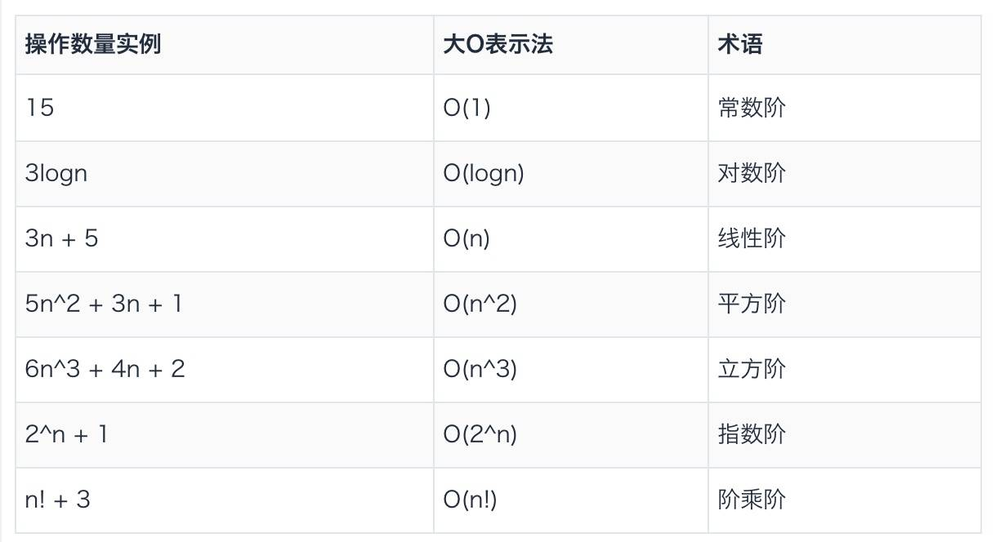

## 大O复杂度表示法

学习数据结构与算法的目的就是‘快’和‘省’

### 时间复杂度

```js
 function total(n) { // 1
      var sum = 0; // 2                        1
      for (var i = 0; i < n; i++) { // 3       n
        for (var j = 0; j < n; j++) { // 4     n²
          sum = sum + i + j; // 5              n²
        }
      }
    }

```

 设单位时间为t， 总时间f(n) =（1+n+n²+n²）

当n很大时，可以忽略常数项，保留最大量级即可

并不代表代码真正执行的时间，而是表示代码随数据规模增长的变化趋势

代码执行的总时间与每行代码执行的次数成正比  T(n) = O(fn) = O(2n²+1) =O(n²)

1、只关注执行次数最多的一段代码

2、总复杂度等于量级最大的那段代码的复杂度

3、嵌套的代码复杂度等于嵌套内外代码复杂度的乘积

  


对数阶的例子：

```js
 function total1(n) {
      var sum = 0;
      var i = 1;
      while (i <= n) {
        sum += i;
        i = i * 2;
      }
    }
    function total2(n) {
      var sum = 0;
      for (var i = 1; i <= n; i = i * 2) {
        sum += i;
      }
    }
```

这边可以看出，变量i从1开始取值，每循环一次x2，实际上i的取值就是一个等比数列

 2^0 2^1 2^2 ... 2^k... 2^x =n; 

所以

 2^x = n     =》 x = log2n  所以时间复杂度为 O(log2n)   常常忽略对数中的底数变成 O(logn)   那nO(logn)含义就很明确，就是其O(logn)代码执行了n次


O(m+n), O(m*n)

```js
 function total(m,n) {
      var sum1 = 0;
      for (var i = 0; i < n; i++) {
        sum1 += i;
      }
      var sum2 = 0;
      for (var i = 0; i < m; i++) {
        sum2 += i;
      }
      return sum1 + sum2;
    }
```

由于无法判读m、n的量级谁比较大，其任意一个都不能忽略


### 空间复杂度

表示算法的存储空间和数据规模之间的关系

表示内存的消耗

方法和时间复杂度的推算方法大致相同

```js
function initArr(n) {
      var arr = [];
      for (var i = 0; i < n; i++) {
        arr[i] = i;
      }
    }
```

每次数组赋值都会申请一个空间存储变量，所以此函数的空间复杂度为O(n)


## 数据结构

 [http://www.conardli.top/docs/dataStructure/%E4%BA%8C%E5%8F%89%E6%A0%91/%E4%BA%8C%E5%8F%89%E6%90%9C%E7%B4%A2%E6%A0%91%E7%9A%84%E5%90%8E%E5%BA%8F%E9%81%8D%E5%8E%86.html#%E9%A2%98%E4%BA%8C%E5%8F%89%E6%A0%91%E7%9A%84%E5%90%8E%E7%BB%AD%E9%81%8D%E5%8E%86](http://www.conardli.top/docs/dataStructure/二叉树/二叉搜索树的后序遍历.html#题二叉树的后续遍历) 

分为逻辑结构和存储结构

逻辑结构：就是数据之间的关系，分为线性结构和非线性结构

线性结构：是一个有序数据元素的集合，其中数据元素之间的关系是一对一的关系，即除了第一个和最后一个数据元素之外，其他数据元素都是首尾相接的

栈、队列、链表、线性表

非线性结构：二维数组、树


存储结构：逻辑结构是指数据间的关系，而存储结构是逻辑结构用计算机语言的实现

顺序结构、链式存储、索引存储、散列存储

例如： 数组在内存中的位置是连续的，它就属于顺序存储；链表是主动建立数据间的关联关系的，在内存中却不一定是连续的，它属于链式存储；还有顺序和逻辑上都不存在顺序关系，但是你可以通过一定的方式去放问它的哈希表，数据散列存储。 


### 数据结构-二叉树

#### 遍历

前序遍历：根左右

中序遍历：左根右

后序遍历：左右根

这边如果使用递归的方法的话很简单

例如：中序遍历

ps：之前不知道怎么把array转化为tree的

```js
let oldArray = [1, null, 2 ,3]
let tree = {
  val: 1,
  right: {
    val: 2,
    left: {
      val: 3
    }
  }
}
var inorderTraversal = function (root, array = []) {
  if (root) {
    inorderTraversal(root.left, array)
    array.push(root.val)
    inorderTraversal(root.right, array);
  }
  return array
}
console.log(inorderTraversal(tree))
```


#### 重建二叉树

就是知道，前序遍历和中序遍历，重建出该二叉树

思路：

1、由前序遍历找出root

2、找到中序遍历中root所在的位置，那么它的左边就是左子树中序遍历，右边就是右子树中序遍历

3、利用递归的思想，重建二叉树

```js
let pre = [1,2,4,7,3,5,6,8]
let vin = [4,7,2,1,5,3,8,6]
function TreeNode(val) {
  this.val = val;
  this.left = this.right = null;
}
function reConstructBinaryTree(pre, vin) {
    if(pre.length === 0){
        return null;
    }
    if(pre.length === 1){
        return new TreeNode(pre[0]);
    }
    const value = pre[0];
    const index = vin.indexOf(value);
    const vinLeft = vin.slice(0,index);
    const vinRight = vin.slice(index+1);
    const preLeft = pre.slice(1,index+1);
    const preRight = pre.slice(index+1);
    const node = new TreeNode(value);
    node.left = reConstructBinaryTree(preLeft, vinLeft);
    node.right = reConstructBinaryTree(preRight, vinRight);
    return node;
}

console.log(reConstructBinaryTree(pre, vin))
```


#### 对称二叉树（镜像二叉树）

判断一个二叉树是不是对称的

1、两个根节点相同

2、左子树的右节点 = 右子树的左节点

3、左子树的左节点 = 右子树的右节点

```js
function isSymmetrical(pRoot) {
  return isSymmetricalTree(pRoot.left, pRoot.right)
}
function isSymmetricalTree(node1, node2) {
  if (!node1 && !node2) {
    return true
  }
  if (!node1 || !node2) {
    return false
  }
  if (node1.val != node2.val) {
    return false
  }
  return isSymmetricalTree(node1.left, node2.right) && isSymmetricalTree(node1.right, node2.left)
}

let node1 = {
  val: 8,
  left: {
    val: 6,
    left: {
      val: 5,
    },
    right: {
      val: 7
    }
  },
  right: {
    val: 6,
    left: {
      val: 7
    },
    right: {
      val: 5
    }
  }
}

let node2 = {
  val: 8,
  left: {
    val: 6,
    left: {
      val: 5
    },
    right: {
      val: 7
    }
  },
  right: {
    val: 6,
    left: {
      val: 7
    },
    right: {
      val: 5
    }
  }
}

console.log(isSymmetrical(node1))
```


#### 二叉树的镜像

思路：递归二叉树所有节点左右节点的位置

ps：就是左节点变右节点，右节点变左节点

```
       源二叉树 
    	    8
    	   /  \
    	  6   10
    	 / \  / \
    	5  7 9 11
    	镜像二叉树
    	    8
    	   /  \
    	  10   6
    	 / \  / \
    	11 9 7  5
```

```js
let tree = {
  val: 8,
  left: {
    val: 6,
    left: {
      val: 5
    },
    right: {
      val: 7
    }
  },
  right: {
    val: 10,
    left: {
      val: 9
    },
    right: {
      val: 11
    }
  }
}
function Mirror(root) {
  if (root) {
    const temp = root.right
    root.right = root.left
    root.left = temp
    Mirror(root.right)
    Mirror(root.left)
  }
}
Mirror(tree)
console.log(tree)
```


#### 二叉查找树

又称二叉搜索树、有序二叉树、排序二叉树

特征：

1、若任意节点的左子树不空，则左子树上的所有节点的值均小于它的根节点的值

2、若任意节点的右子树不空，则右子树上的所有节点的值均大于它的根节点的值

3、任意节点的左右子树也分别为二叉查找树

4、没有键值相同的节点

优势：查找、插入的时间复杂度较低均为O(log n)，二叉查找树是基础性线性结构，


例如：给定一个搜索二叉树，找出其第K小的节点

二叉树的中序遍历就是排序后的节点

```js
  //递归实现
    function KthNode(pRoot, k) {
      const arr = [];
      loopThrough(pRoot, arr); // 得到中序遍历的数组，也就是排序后的数组
      if (k > 0 && k <= arr.length) {
        return arr[k - 1];
      }
      return null;
    }

    function loopThrough(node, arr) {
      if (node) {
        loopThrough(node.left, arr);
        arr.push(node);
        loopThrough(node.right, arr);
      }
    }
```


#### 二叉树的最大深度

解释：为根节点到最远叶子节点的最长路径上的节点数

叶子节点：没有子节点的节点

思路：深度优先遍历+分治

一颗二叉树的最大深度=左子树的深度和右子树的最大深度的最大值+1

```js
	3
   / \
  9  20
    /  \
   15   7


function TreeDepth(pRoot) {
  if (!pRoot) {
    return 0
  }
  return Math.max(TreeDepth(pRoot.left), TreeDepth(pRoot.right)) + 1
}

console.log(TreeDepth(tree))
```


#### 平衡二叉树

解释： 每个子树的深度之差不超过 1

思路：

1、后续遍历二叉树

2、在遍历二叉树每个节点都会遍历其左右子树

3、比较左右子树的深度，若差值大于1则返回一个标记-1表示当前子树不平衡

4、左右子树有一个不是平衡的，或左右子树差值大于1，则整棵树不平衡

5、若左右子树平衡，返回当前树的深度（左右子树的深度最大值）

```js
let tree = {
  val: 3,
  left: {
    val: 9
  },
  right: {
    val: 20,
    left: {
      val: 15
    },
    right: {
      val: 7
    }
  }
}

function IsBalanced_Solution(pRoot) {
  return balanced(pRoot) != -1;
}
function balanced(node) {
  if (!node) {
    return 0;
  }
  const left = balanced(node.left);
  const right = balanced(node.right);
  if (left == -1 || right == -1 || Math.abs(left - right) > 1) {
    return -1;
  }
  return Math.max(left, right) + 1;
}
console.log(IsBalanced_Solution(tree))
```

