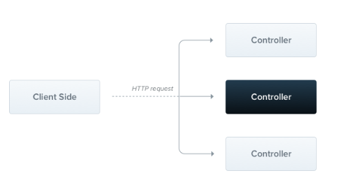
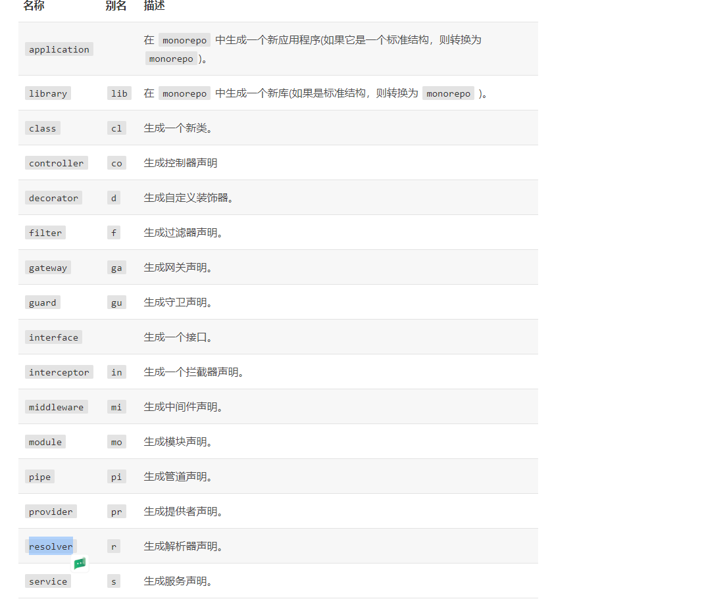
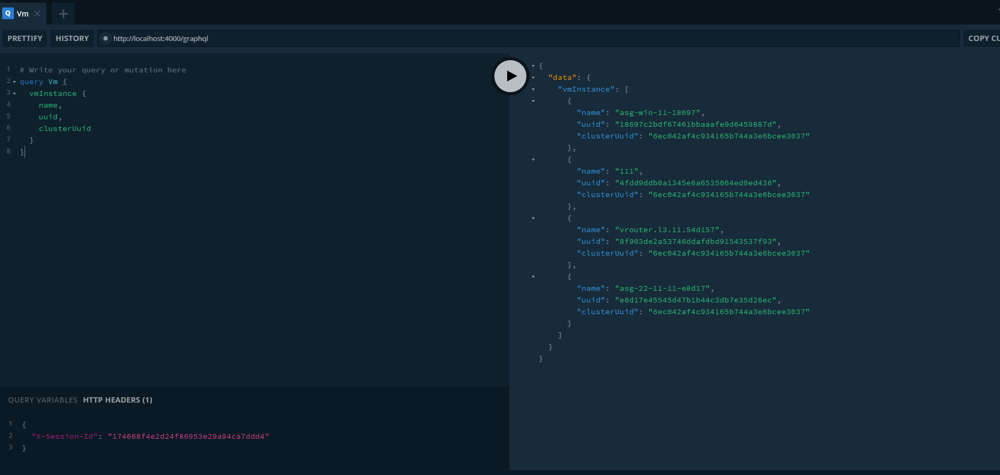

这边官方给的定义是渐进式的nodejs框架

用于构建高效、可靠、可扩展的服务器端应用框架，在底层，nest使用强大的http server框架，如express（默认）和fastify


nestjs依赖注入，pipe、guard、interceptor等机制，基本覆盖各种开发需要，**开箱即用**

中文文档： https://docs.nestjs.cn/ 

中文文档： https://docs.nestjs.cn/7/introduction 

express、koa、eggjs、midway、nestjs比较

koa：一个拥有洋葱模型中间件的**http处理库**，一个请求，经过一系列的中间件，最后响应。koa的大致实现原理：context上下文的保存和传递，中间件的管理和next方法的实现

koa、express：这两者之间做比较，两者都是偏底层的无状态的web框架

nestjs、eggjs、midway：这三者之间做比较，eggjs源于阿里，被认为是框架的框架（基于koa封装的框架），再上一层还有midway


### 关于webhook的配置

ZS_WEBHOOK_URI=http://172.21.0.120:3000/webhook

配置的是当前开发机的ip地址，（port 是当前项目所占用的端口号）


大树gitlab地址

http://dev.zstack.io:9080/xiang.gao/zstack-ui-server


NestFactory用来根据module创建nest应用实例，在main.ts文件中


app.module.ts：应用程序的根模块


结合demo看文档

## 一、控制器

负责处理传入的请求和客户端返回响应

主要目的：接收客户端特定的请求

cli创建控制器

```js
$ nest g controller cats
```

g： generate： 生成

### 1、路由

​	路由机制会控制哪个控制器接收哪些请求，通常，每个控制器有多个路由，不同的路由课可以执行不同的操作

​	路由= 控制器的前缀+请求装饰器  生成

端点修饰符：@Put()、@Delete()、@Patch()、@Options()、@Head()、@All()、@Get()、@Post()，表示这个的http请求方法

请求装饰器中支持正则表达式

例如：@Get(‘ab*cd’)

这边*为通配符，匹配任何字符




### 2、request

许多端点需要访问客户端的请求细节。实际上，nest正使用类库特有（默认是express）的请求对象，因此可以强制nest使用@Req（）装饰器将请求对象注入处理程序


Resquest对象表示http请求，并具有request查询字符串、参数、http标头、正文的属性

大多数情况下不必手动获取他们，可以使用专用的修饰器，例如：**@body() 或 @Query()**

修饰器对应的普通表达对象

| 修饰器                    | 普通表达对象                        |
| ------------------------- | ----------------------------------- |
| @Request()                | req                                 |
| @Response()   别名@Res()* | res                                 |
| @Next()                   | next                                |
| @Session()                | req.session                         |
| @Param(key?: string)      | `req.params` / `req.params[key]`    |
| @Body(key?: string)       | `req.body` / `req.body[key]`        |
| @Query(key?: string)      | `req.query` / `req.query[key]`      |
| @Headers(name?: string)   | `req.headers` / `req.headers[name]` |
| @Ip()                     | req.ip                              |


### 3、资源

状态码

这边响应的状态码总是200，除了post请求外，它是201，这边额可以这样更改

处理程序中添加@HttpCode(…)可更改状态码

Headers

自定义响应头

```js
import { Controller, Get, Req, Post, HttpCode, Header } from '@nestjs/common'
import { Request } from 'express'

@Controller('cat')  //这个地方对应的是路由前缀
export class CatsController {
  @Get()
  findAll(@Req() request: Request): string {
    // console.log(request)  //这边就可以知道客户端请求的所有细节
    return 'This action returns all cats'
  }

  @Post()
  @HttpCode(204)  // 改变状态码
  @Header('Cache-Control', 'none')  // 自定义响应头
  create(): string {
    return 'add a cat'
  }

}

```


重定向

将响应重定向到特定的url，并且可以指定状态码

```js
@Redirect('https://nestjs.com', 301)
```


### 路由参数

支持动态路由，可以在路由中添加路由参数标记

@param()装饰器

```js
import { Controller, Get, Req, Post, HttpCode, Header, Param } from '@nestjs/common'
@Get(':id')
findOne(@Param() params): string {
  console.log(params)
  return `this is ${params.id} cat`
}
```


### 子域路由

@Controller装饰器可以接受一个host选项，用来要求请求的http主机匹配某个特定值

```js
@Controller({ host: ':account.example.com' })
export class AccountController {
  @Get()
  getInfo(@HostParam('account') account: string) {
    return account;
  }
```


### Async/await

next支持异步函数，每个异步函数必须返回Promise

```js
@Get()
  async findAll(): Promise<any[]> {
    return ['one', 'two', 'three'];
  }
```


### 请求负载dto

之前的Post路由处理程序不接受任何客户端参数，这里可以添加@Body()参数来解决这个问题

DTO：数据传输对象模式，是一个对象，定义如何通过网路发送数据

类似于model，定义客户端发来的数据类型

```js
@Post()
  create(@Body() createCatDto: CreateCatDto): string {
    console.log(createCatDto)
    return 'add a cat'
  }
```


错误处理----异常处理


**控制器总是属于模块，这就是为什么我们将controllers数组保存在@modules()装饰器中**


## 二、提供者：providers

```js
// 应用程序的根模块
import { Module } from '@nestjs/common';
import { AppController } from './app.controller';
import { CatsController } from './cats.controller';
import { AppService } from './app.service';

@Module({
  imports: [],
  controllers: [AppController, CatsController],
  providers: [AppService],    // 提供者
})
export class AppModule {}

```

**cli提供者**


有点像service层

这边可以通过constructor（构造器）注入依赖关系。这意味着对象可以彼此创建各种关系， 并且“连接”对象实例的功能在很大程度上可以委托给 `Nest`运行时系统 。provider只是一个用@Injectable()装饰器注释的类。

控制器：处理http请求，并将更复杂的任务委托给providers。这边就是做一些复杂逻辑处理

injectable： 中文翻译：可注射的

providers：**纯粹的javaScript类，在其类声明之前带有@injectable()装饰器**

这边可以通过控制器注入依赖关系，例如这样

```js
import { Controller, Get } from '@nestjs/common';
import { AppService } from './app.service';

@Controller() 
export class AppController {
  constructor(private readonly appService: AppService) {}  // 通过构造器注入依赖关系（类构造函数注入）

  @Get()
  getHello(): string {
    return this.appService.getHello();
  }
}
```


```js
import { Injectable } from '@nestjs/common';

@Injectable()
export class AppService {   //服务类
  getHello(): string {  // 这边处理控制器委托的更复杂的任务
    return 'Hello World!hahhaa';
  }
}

```

 要使用 `CLI` 创建服务类，只需执行 `$ nest g service cats` 命令。 

这边如果使用cli的话，可以直接导入，不再需要手动导入


这边**CatsService**就是一个基本类，唯一的新特点就是使用了装饰器@Injectable()，而这个@Injectable()附加有元数据，加上的话，next就知道**CatsService**是个服务类


provider通常具有与应用程序生命周期同步的生命周期（作用域）。在启动应用程序时，必须解析每个依赖项，因此必须实例化每个应用程序


### 自定义提供者

`Nest` 有一个内置的控制反转（`"IoC"`）容器，可以解决providers之间的关系。 此功能是上述依赖注入功能的基础，但要比上面描述的要强大得多。`@Injectable()` 装饰器只是冰山一角, 并不是定义 providers 的唯一方法。相反，您可以使用普通值、类、异步或同步工厂。看看[这里](https://docs.nestjs.cn/7/fundamentals)找到更多的例子。

@optional()装饰器，这边有时provider会依赖一些配置对象，但是如果没有传递的话，应该给一个默认值，这边就是处理这种情况


@optional()装饰器，这边有时provider会依赖一些配置对象，但是如果没有传递的话，应该给一个默认值，这边就是处理这种情况


在app.module中

```js
providers: [CatsService],  //简化写法 只是为了简化最常见的用例，其中令牌用于请求同名类的实例
```

```js
providers: [
  {
    provide: CatsService,
    useClass: CatsService,
  },
];   //标准的写法（显示构造）
```

在这里可以很明显地看出，**将令牌CatsService与类CatsService关联起来**

**值提供者（useValue）**感觉这个比较有用


## 三、模块

一句话解释：具有@Module装饰器的类。@Module装饰器提供元数据，nest用它来组织应用程序


xxx.module.ts 是执行注入的，创建的控制器和提供者都要在这里注册

这边如果是用cli创建的话，就会自动注入，不需要自己手动注入


这边每个项目必须有一个模块，就是根模块（ ApplicationModule ），如果项目比较大的话，还是分一下功能模块比较好，易于程序员查看代码

cli创建模块

```js
$ nest g module cats
```

全局模块：添加@Global()装饰器，可以使模块变成全局作用域

```js
import { Module, Global } from '@nestjs/common';
import { CatsController } from './cats.controller';
import { CatsService } from './cats.service';

@Global()
@Module({
  controllers: [CatsController],
  providers: [CatsService],
  exports: [CatsService],
})
export class CatsModule {}
```


#### 全局模块：

被@Global()修饰的模块，使模块成为全局作用域

```js
@Global()
```


#### 动态模块

动态生成模块


## 四、中间件：NestMiddleware

路由处理之前调用的函数，中间件可以访问，请求和响应对象


express的next()

nest中间件等价于express中间件

中间件支持依赖注入，就像提供者和控制器一样，通过constructor

#### 应用中间件

```js
import { Injectable, NestMiddleware } from '@nestjs/common';
import { Request, Response } from 'express';

@Injectable()
export class LoggerMiddleware implements NestMiddleware {
  use(req: Request, res: Response, next: Function) {
    console.log('Request...'); // 这边呢就做一系列的操作，甚至能改请求路径
    next();
  }
}
```

注意：这边不能直接在module中列出，得使用模块类configure

exclude排除一些不需要中间件的controller


#### 函数式中间件

当中间件没有任何依赖的时候，可以使用函数式中间件

```js
export function logger(req, res, next) {
  console.log(`Request...`);
  next();
};
```

```js
consumer
  .apply(logger)
  .forRoutes(CatsController);
```


#### 全局中间件

在main.ts中注册全局中间件，使用use

```js
const app = await NestFactory.create(AppModule);
app.use(logger);
await app.listen(3000);
```


## 五、管道：PipeTransform

具有@Injectable() 装饰器的类，实现pipeTransform接口

管道有两个类型

**转换**：管道将输入数据转换为所需的数据输出

**验证**：对输入数据进行验证，如果验证成功继续传递，验证失败抛出异常

ps：让我感觉就是对传输数据的预处理已经验证，使其符合要求，我感觉用了ts之后，就不需要用这个了


#### 内置管道

几个开箱即用的内置管道

1、ValidationPipe

2、ParseIntPipe

3、ParseBoolpipe

4、ParseUUIDPipe

如果是内置管道不不是直接用吗，这边怎么感觉不是


#### 绑定管道 

使用@UsePipes()装饰器并创建一个管道实例

```js
@Post()
@UsePipes(new JoiValidationPipe(createCatSchema))
async create(@Body() createCatDto: CreateCatDto) {
  this.catsService.create(createCatDto);
}
```


## 六、守卫：CanActivate

一种使用Injectable()装饰器的类，守卫应该实现CanActivate接口

这边返回的是一个boolean


感觉和中间件的作用差不多，传统的express，这边的功能也是用中间件来处理的

守卫的设计与异常过滤器、管道、拦截器非常相似，目的是让您在请求/响应周期的正确位置插入处理逻辑，并以声明的方式进行插入，有助于保持代码的简洁性和声明性

注：ExecutionContext ：提供了更多功能，它扩展了ArgumentsHost，但是也提供了有关当前执行过程的更多详细信息

```js
import { Injectable, CanActivate, ExecutionContext } from '@nestjs/common';
import { Observable } from 'rxjs';

@Injectable()
export class AuthGuard implements CanActivate {
  canActivate(
    context: ExecutionContext,   // 这个实例包含着执行过程中的详细信息
  ): boolean | Promise<boolean> | Observable<boolean> {
    const request = context.switchToHttp().getRequest();
    return validateRequest(request);  //这边返回的是布尔值
  }
}
```


#### 绑定守卫

使用@UseGuards()装饰器

```js
@Controller('cats')
@UseGuards(RolesGuard)  // 这边传递的是一个类，让框架实例化，也可以传递new RolesGuard()
export class CatsController {}
// 这边就是在进入之前会调用守卫，守卫执行通过才能进入
```


#### 全局守卫

```js
const app = await NestFactory.create(AppModule);
app.useGlobalGuards(new RolesGuard());
```


## GraphQL

next中提供了两种构建GraphQL应用程序的方式：模式优先、代码优先

模式优先：

代码优先：ui-server-4.0用的就是代码优先

下载过后，导入项目

```js
import { Module } from '@nestjs/common';
import { GraphQLModule } from '@nestjs/graphql';

@Module({
  imports: [
    GraphQLModule.forRoot({}),
  ],
})
export class ApplicationModule {}
```

.forRoot()函数将选项对象作为参数，这些选项将传递给底层的Apollo实例

如果想要禁用图形化GeaphQL并开始debug模式，可以这样

```js
import { Module } from '@nestjs/common';
import { GraphQLModule } from '@nestjs/graphql';

@Module({
  imports: [
    GraphQLModule.forRoot({
      debug: false,
      playground: false,
    }),
  ],
})
export class ApplicationModule {}
```


多个端点

该模块另一个有用的功能就是能够为多个端点提供服务

```js
GraphQLModule.forRoot({
  include: [CatsModule],
}),
```


代码优先

```js
GraphQLModule.forRoot({
  typePaths: ['./**/*.graphql'],
  autoSchemaFile: 'schema.gql',
}),
```


resolver文件注入依赖，可以用@Inject()注入，例如这样

```js
@Resolver('Cluster')
export class ClusterResolver {
  @Inject() clusterQueryService: ClusterQueryService

  @Query(returns => [Cluster])
  async cluster () {
    return this.clusterQueryService
  }
}
```

ResolveField(Int32)：返回由指定元数据令牌标识的字段

## cli指令

 https://docs.nestjs.cn/6/cli 

感觉用cli比较方便

安装 nest cli

```js
$ npm install -g @nestjs/cli
```

| name          | alias（别名） |
| ------------- | ------------- |
| application   | application   |
| class         | cl            |
| configuration | config        |
| controller    | co            |
| decorator     | d             |
| filter        | f             |
| gateway       | ga            |
| guard         | gu            |
| interceptor   | in            |
| interface     | interface     |
| middleware    | mi            |
| module        | mo            |
| pipe          | pi            |
| provider      | pr            |
| resolver      | r             |
| service       | s             |
| library       | lib           |
| sub-app       | app           |


根据原理图生成或修改文件

```js
$ nest generate <schematic> <name> [options]
$ nest g <schematic> <name> [options]
```

option中有一个比较实用

 --flat    不要为元素生成文件夹






