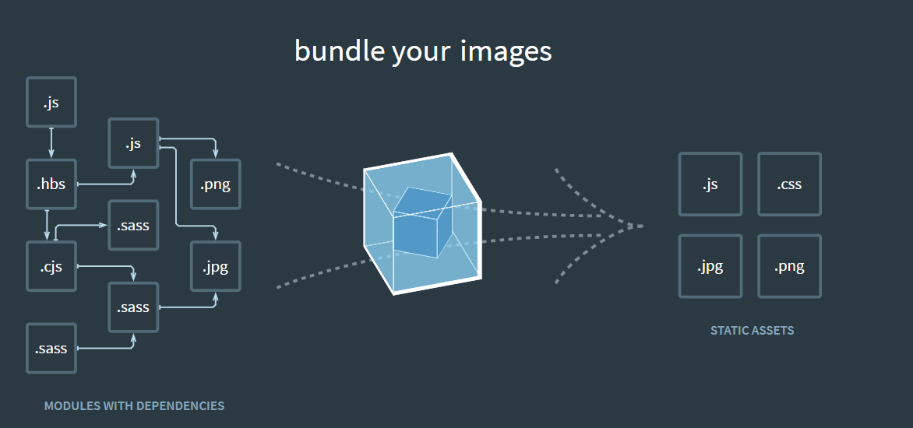

## 一、官网图片



从图片上就可以看出webpack的主要作用，就是把多个文件分类打包成一个文件

webpack现在已经到5.0

webpack.config.js

模块打包工具，管理我们的模块，并编译输出模块们所需的静态文件


## 二、概念

本质：是一个现代javascript应用程序的静态模块打包工具。当webpack处理应用程序时，它会在内部构建一个==依赖图==，此依赖图会映射项目所需的每个模块，并生成一个或者多个bundle

名词解释:

1、 映射：给一个对象（变量、物体）等，起一个唯一的别名 。例如java中的Map就是一问个表达映射的类. Map names = new HashMap(); names.put("编号9527","唐伯虎"); 这个例子就是把答编号9527映射到唐伯虎上,只需要告诉程版序你要找编号9527,程序就能权找到唐伯虎.这就是映射 

2、bundle：是由不同的模块生成，bundles包含了早已经过加载和编译的最终源文件版本

bundle分离：这个流程提供了一个优化build的方法，允许webpack为应用程序生成多个bundle。最终效果是，当其他某些bundle改动时，彼此独立的另一些bundle都可以不受影响，减少重新发布的代码量，因此由客户端重新下载并利用浏览器缓存

3、依赖图：一个文件依赖另一个文件，webpack就把此视为文件之间有依赖关系。这边就可以使得webpack可以接收非代码资源，（例如：图片、字体什么的），并且作为依赖提供给应用程序


## 三、入口（entry）

这边呢，就是告诉webpack，以哪个模块作为构建内部依赖图的开始

这边一般都是src/index.js

单入口：字符串

多入口：对象{

index： ‘./src/index.js’

}  // index 为打包的文件的name，后面的是这个文件的路径

```js
entry: path.join(__dirname, "/src/index.js"), // 入口文件
```


## 四、出口（output）

这边就是告诉webpack，它所创建的bundle，存在哪，一般是./dist文件夹中

```js
output: {
    path: path.join(__dirname, "/dist"), // 打包后的文件存放的地方 
    filename: "bundle.js" // 打包后输出文件的文件名
  },
```


## 五、loader（module）

webpack只能理解JavaScript和json的文件。loader让webpack能够处理其他的文件。

loader一般有两个属性

test：用于被标识哪个文件要用到该loader进行转换，这边这边用正则匹配其后缀

use：进行转换时应该用哪个loader

```js
module: {
    rules: [
      {
        test: /\.css$/,
        use: ['style-loader', 'css-loader'] // 需要用的loader，一定是这个顺序，因为调用loader是从右往左编译的
      },
      {
        test: /\.(sass|scss)$/,
        use: ['style-loader', 'css-loader', 'sass-loader']
      }
    ]
  },
```


## 六、插件（plugin）

loader呢，是用来转换某些类型的模块，而插件的作用更为广泛，可以：打包优化、资源管理、注入环境变量

```js
const HtmlWebpackPlugin = require('html-webpack-plugin');
.
.
.
plugins: [
    new webpack.BannerPlugin('版权所有，翻版必究'), // new一个插件的实例，这边是webpack自带的插件，也可以自定义插件require进来就可以了
    new HtmlWebpackPlugin({
      template: path.join(__dirname, "/src/index.html") // new一个这个插件的实例，并传入相关的参数, 为应用程序生成一个HTML文件按，并且注入所有生成的bundle
    })
  ]
```

更多插件链接： https://webpack.docschina.org/plugins 


## 七、模式（mode）

表明当前是开发环境还是生产环境，一般情况下，感觉看不见这个字段，这边启用webpack的时候默认为production环境

development ： 开发模式

```js
module.exports = {
  mode: 'production'  //生产模式
};
```

 

| 选项        | 描述                                                         |
| ----------- | ------------------------------------------------------------ |
| development | 会将definePlugin中process.env.NODE_ENV的值1设置为development。启用NamedChunksPlugin和NamedModulesPlugin |
| production  | 会将 `DefinePlugin` 中 `process.env.NODE_ENV` 的值设置为 `production`。启用 `FlagDependencyUsagePlugin`, `FlagIncludedChunksPlugin`, `ModuleConcatenationPlugin`, `NoEmitOnErrorsPlugin`, `OccurrenceOrderPlugin`, `SideEffectsFlagPlugin` 和 `TerserPlugin`。 |
| none        | 退出任何默认优选项                                           |

记住，设置 NODE_ENV 并不会自动地设置 mode。


## 八、开发中server（devServer）

```js
devServer: {
    contentBase: path.join(__dirname, "dist"),
    hot: true,
    port: '8080',
    inline: true,
    open: true,
    overlay: true,
    proxy: {
      '/api': {
        target: '',   //服务端端口
        changeOrigin: true,   //解决跨域问题
        pathRewrite: {
          '^/api': ''   //忽略api
        }
      }
    }
  },
```


## 九、webpack打包后的文件解析

里面是个自调用函数

参数是通过对象的形式传递

key： 文件的路径

value： 一个函数（通过eval执行当前文件的代码）

eval： 执行字符串代码

如果有多个相互依赖的文件，最终打包成一个文件

怎么把所有文件打包后，形成一个文件的：

答：通过__webpack_require__  （模拟了require方法）  原理：通过递归的方式，不停的调用自己

```js
（function （） {
    
}）（{
    "./src/index.js": (function(module, exports) { })
}）
```


## 十、

1、打包的工作原理、机制、热更新原理

2、项目中webpack干了什么


## webpack优化

打包：体积更小、速度更快

优化：懒加载、热更新，不用的不引入、大的包放在cdn上


### a、自带的优化

tree-sharking： 依赖关系的解析：不用的代码不打包     注意：**生产环境才会有效**

scope-hoisting： 作用域提升：变量 --->结果，不会被打包到代码中a、自带的优化


### b、自己实现的优化

#### 体积：

1、moment：时间插件，引入， 不需要的

 IgnorePlugin 就可以把不需要的语言包删掉、

2、externals

```js
externals: {   // 不打包   这是一个配置项
	‘jquery’: ‘$’
}

modules: {
	noParse: /jquery/     // 不解析
}
```

#### 速度：

1、happypack: 多线程打包  

注意：体积比较小，打包速度会比较慢

2、DllPlugin,动态链接库

打包完之后，体积还是过大 20M、10M

拆：公共的文件 react/react-dom/vue

动态链接库：一些想要提取出来的库，

放进一个单独的文件打包，最后可以放到cdn上 加载的速度就会更快了

webpack.react.js

```js
let path = require ('path');
let webpack = require('webpack')

module.exports = {
	mode: 'development',
	entry: {
		react: ['react', 'react-dom']
	},
	output: {
		filename: '__dll__[name].js',
		path: path.resolve(__dirname, 'dist'),
		library: '__dll__[name]'     //返回值
	},
	plugins: [
		new webpack.DllPlugin({   // 生成动态链接库
			name: '__dll__[name]',
			path: path.resolve(__dirname, 'dist', 'mainfest.json')
		}),
		new webpack.DllReferencePlugin({  // 引用动态链接库
			manifest: path.resolve(__dirname, 'dist', 'mainfest.json')
		})
	]
}
```

3、抽离公共代码